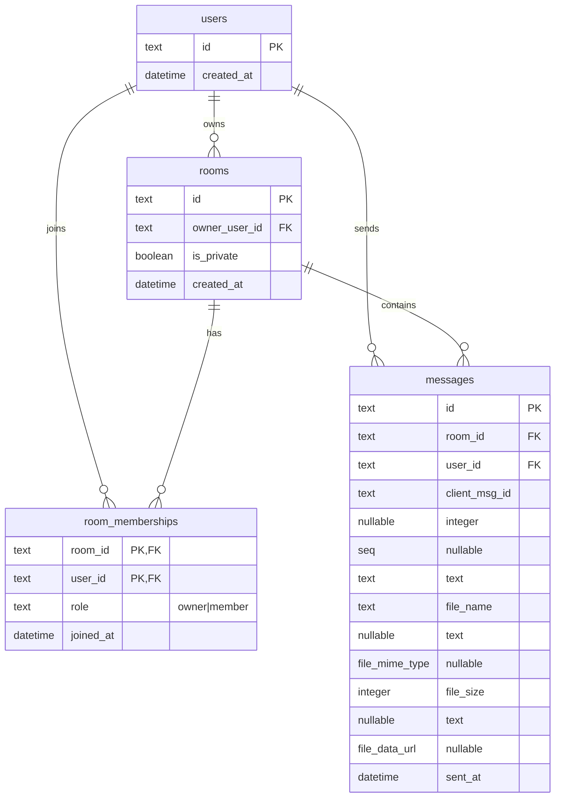

# Realtime Chat SQLite ERD

## Notes
- `room_memberships` uses a composite primary key: `(room_id, user_id)`.
- `messages.file_*` columns are nullable for text-only messages.
- `file_size` is persisted to align with file upload payload validation and replay.
- `messages` has unique keys for reliability:
  - `(room_id, seq)` for ordering
  - `(room_id, user_id, client_msg_id)` for idempotency
